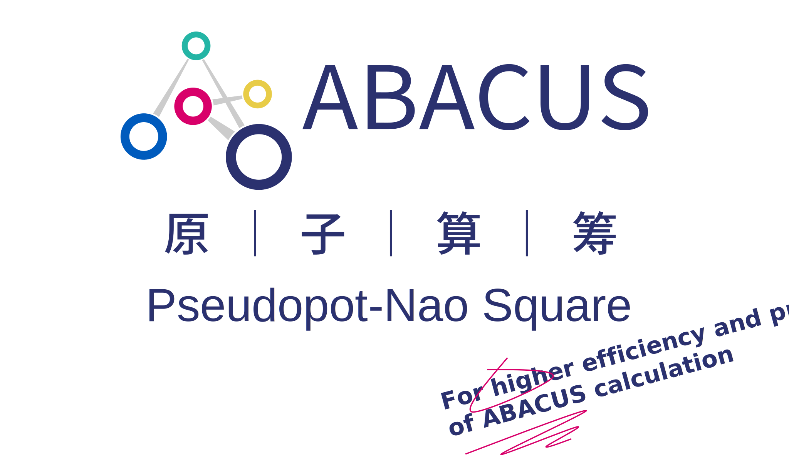

<p align="center">
    
</p>

# ABACUS Pseudopotential-Numerical Atomic Orbital Square
Module name: structures  
## Brief
This module is for download structures used for element/material-wise test or numerical atomic orbital generation.
- download  
Using Materials Project API, download structures of elements or materials.
- parse
With self-built CIF parser, parse CIF files and output informations in dictionary format (see below).
## Data carrier
### CIF
After parse by `module_structure/crystal_information_file.py` the `module_structure.crystal_information_file.read_1` function, the following dictionary will yield:
```json5
{
    "cell_parameters": {
        "a": 5.46745035,
        "b": 5.46745035,
        "c": 5.46745035,
        "alpha": 90.0,
        "beta": 90.0,
        "gamma": 90.0
    },
    "atomic_positions": {
        "Ce": [
            [0.0, 0.0, 0.0],
            [0.0, 0.5, 0.5],
            //...
        ],
        "O": [
            [0.25, 0.75, 0.75],
            [0.75, 0.25, 0.25],
            //...
        ],
        //...
    },
    "atomic_occupancies": {
        "Ce": [
            1.0, 1.0, //...
        ],
        "O": [
            1.0, 1.0, //...
        ]
    }
}
```
### System nomenclature
To identify systems with identical formula, the system is named by the following rule:
[system_chemical_formula]_[materials_project_id].cif  
For example:
```
Er2O3_1225560.cif
```
This name will be parsed by `module_structure.basic.scan_elements` function, to get element information.