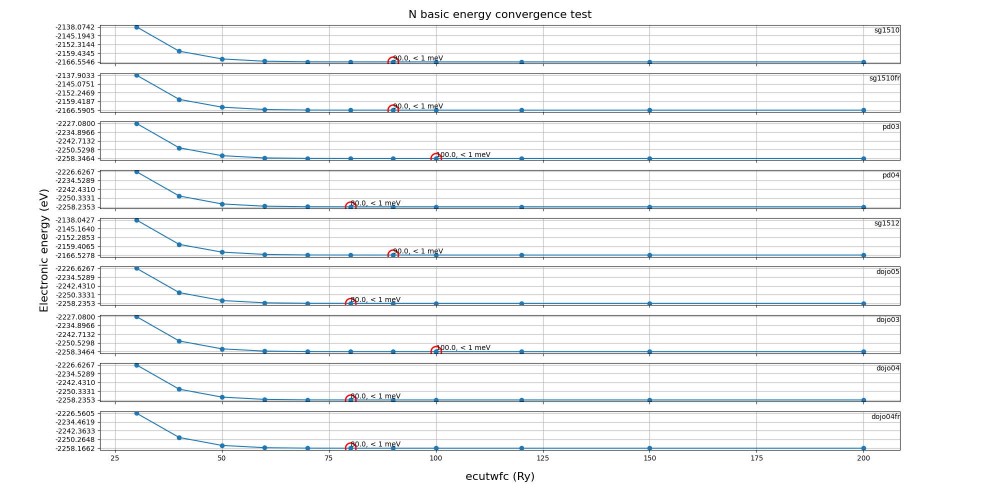

<button onclick="location.href='../../../README.md'">Home page</button>
<button onclick="location.href='pseudopotential.md'">Pseudopotential tests</button>
<button onclick="location.href='../pseudopot-nao_tests/pseudopot-nao.md'">Pseudopot-Nao tests</button>

    

  

# ABACUS Pseudopot-Nao Square  
## Pseudopotential tests
### Test information
    - element: N
    - pseudopotential type: norm-conserving
    - DFT xc functional: PBE
    - software: ABACUS (version: latest commit)
    

    

  