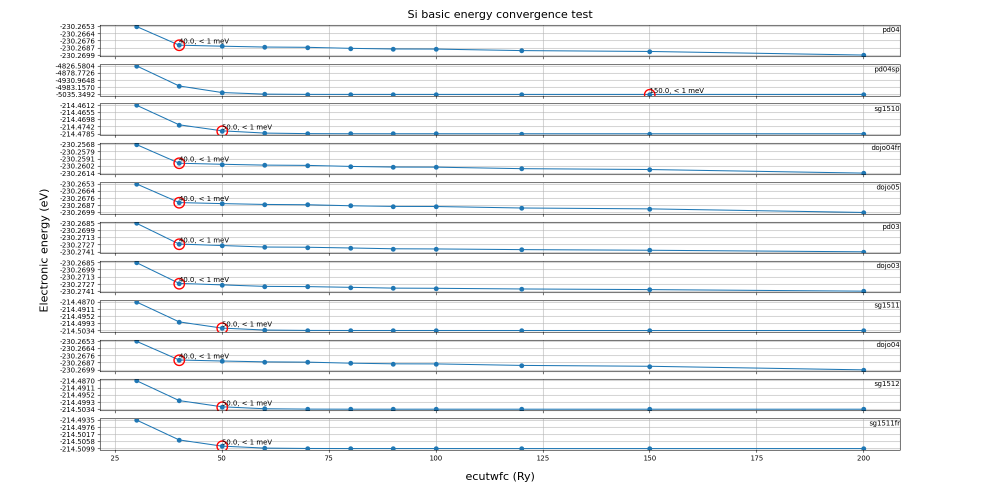

<link rel="stylesheet" type="text/css" href="../components/styles.css">

    

  

 
<button class="top_header_button" onclick="location.href='../../index.md'">
Home page</button>
<button class="top_header_button" onclick="location.href='pseudopotential.html'">
Pseudopotential tests</button>
<button class="top_header_button" onclick="location.href='../pseudopot-nao_tests/pseudopot-nao.html'">
Pseudopot-Nao tests</button>
<button class="top_header_button">
About</button>
 

## Pseudopotential tests
### Test information
    - element: Si
    - pseudopotential type: norm-conserving
    - DFT xc functional: PBE
    - software: ABACUS (version: latest commit)
    

    

  