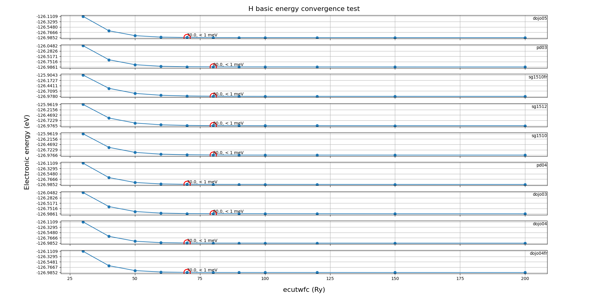

## Pseudopotential tests
### Test information
    - element: H
    - pseudopotential type: norm-conserving
    - DFT xc functional: PBE
    - software: ABACUS (version: latest commit)
    

    

  