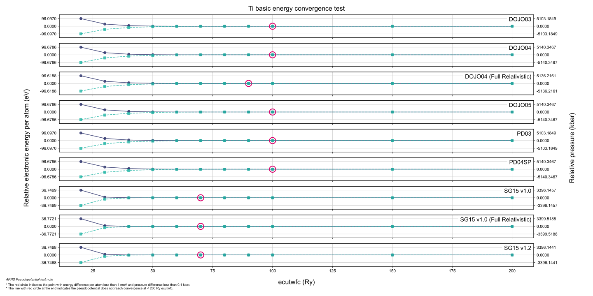

<h1>Pseudopotential tests</h1>
<h2>Test information</h2>
<ul>
    <li>element: Ti</li>
    <li>pseudopotential type: norm-conserving</li>
    <li>DFT xc functional: PBE</li>
    <li>software: ABACUS (version: latest commit)</li>
</ul>
<h2>Test results</h2>
<table>
<tr><td>
<table class="banner-frame">
    <tr>
        <td class="banner-header">Convergence test</td>
    </tr>
    <tr>
        <td class="banner-body">
            

                
            

        </td>
    </tr>
</table>
</td></tr><tr><td>
<table class="banner-frame">
    <tr>
        <td class="banner-header">Equation of States (EOS)</td>
    </tr>
    <tr>
        <td class="banner-body">
            

                No data yet!
            

        </td>
    </tr>
</table>
</td></tr><tr><td>
<table class="banner-frame">
    <tr>
        <td class="banner-header">Cohesive energy curve</td>
    </tr>
    <tr>
        <td class="banner-body">
            

                No data yet!
            

        </td>
    </tr>
</table>
</td></tr><tr><td>
<table class="banner-frame">
    <tr>
        <td class="banner-header">Density of States (DOS)</td>
    </tr>
    <tr>
        <td class="banner-body">
            

                No data yet!
            

        </td>
    </tr>
</table>
</td></tr>
</table>