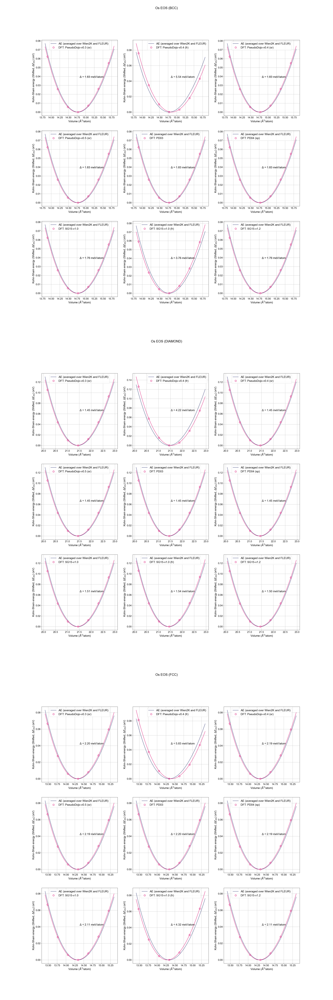

<h1>Pseudopotential tests</h1>
<h2>Test information</h2>
<ul><li>element: Os</li>
<li>pseudopotential type: Os</li>
<li>DFT XC (exchange-correlation) functional: Perdew-Burke-Ernzerhof (PBE)</li>
<li>software: registry.dp.tech/dptech/dp/native/prod-385/abacus-stable:0225</li>
</ul><h2>Test results</h2>
<table>
<tr><td>
<table class="banner-frame">
    <tr>
        <td class="banner-header">Convergence test</td>
    </tr>
    <tr>
        <td class="banner-body">

        </td>
    </tr>
</table></td></tr>
<tr><td>
<table class="banner-frame">
    <tr>
        <td class="banner-header">Equation of States (EOS)</td>
    </tr>
    <tr>
        <td class="banner-body">

        </td>
    </tr>
</table></td></tr>
<tr><td>
<table class="banner-frame">
    <tr>
        <td class="banner-header">Cohesive energy</td>
    </tr>
    <tr>
        <td class="banner-body">

Cohesive energy data will be available soon.

        </td>
    </tr>
</table></td></tr>
<tr><td>
<table class="banner-frame">
    <tr>
        <td class="banner-header">Density of States (DOS)</td>
    </tr>
    <tr>
        <td class="banner-body">

Density of States (DOS) data will be available soon.

        </td>
    </tr>
</table></td></tr>
</table>
