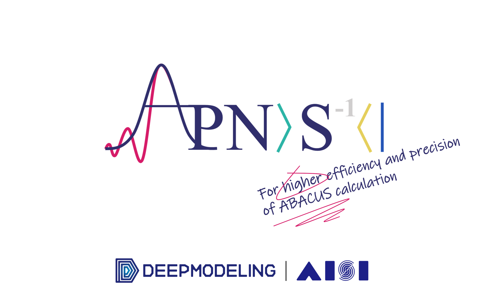

<p align="center">
    
</p>  

# ABACUS Pseudopot-Nao Square

## Download folder: manage all downloaded files on your own

This folder is for illustrating how to manage downloaded files on your own. For example if you have a input file like

```json
{
    "global": {
        "pseudo_dir": "path/to/pseudo",
        "orbital_dir": "path/to/orbital"
    }
}
```

Then you should make sure you have files named `database.json` in both the folder you specified in `pseudo_dir` and `orbital_dir`. The content of `database.json` should be like

```json
{
    "path/to/the/upf/file": [
        "tag1", "tag2", "tag3"
    ]
}
```

Then APNS will search by tags and get all the upf/orb file(s) that with all tags you specified.

## Where to get pseudopotential/numerical atomic orbital files?

Here we list several resources where you can download pseudopotential files. Please note: once you use the pseudopotential files, you are obliged to reference to proper sources
in your publication.

### Websites

- [Quantum Espresso](https://www.quantum-espresso.org/pseudopotentials): the official website of Quantum Espresso, where you can find a large number of pseudopotential files.

- [Stantard Solid State Pseudopotential library](https://www.materialscloud.org/sssp): a library of **high-quality** pseudopotentials for solid-state calculations, with **a large number of tests on efficiency and precison**.

- [PWmat](http://www.pwmat.com/potential-download): a website that provides a large number of pseudopotential files, various kinds of semi-core constructed pseudopotentials are included. **Several sets (with or without f-electrons/noncolinear core correction) of Lanthanide pseudopotentials are also available**.

- [THEOS](http://theossrv1.epfl.ch/Main/Pseudopotentials): PSlibrary 0.3.1, a library of pseudopotentials for DFT calculations, including ultrasoft, paw, norm-conserving both full-relativistic and scalar-relativistic pseudopotentials.

- [ABACUS@USTC](https://abacus.ustc.edu.cn/pseudo/list.htm): **ABACUS official website** where you can find a large number of pseudopotential files and numerical atomic orbital files.

### Norm-conserving pseudopotentials

- [SG15](http://www.quantum-simulation.org/potentials/sg15_oncv/): **vastly used in ABACUS** DFT calculation and numerical atomic orbital generation.

- [PseudoDOJO](http://www.pseudo-dojo.org/): another widely used pseudopotential database, developed by Abinit group, **including Lanthanide pseudopotentials (f-electrons frozen)**.

- [The Rappe group](https://www.sas.upenn.edu/rappegroup/research/pseudo-potential-gga.html): a collection of GGA pseudopotentials which are generated with Opium code, several tests proves that are out-performing in alloy systems.

- [Matteo Giantomassi's Github repo](https://github.com/gmatteo/pseudos_ac_she): a Github repository that contains norm-conserving pseudopotentials for **Actinides and superheavy elements to 120-th element**.

### Ultrasoft pseudopotentials

- [Vanderbilt](http://www.physics.rutgers.edu/~dhv/uspp/): a collection of ultrasoft pseudopotentials generated by Vanderbilt group.

- [GBRV](https://www.physics.rutgers.edu/gbrv/) by Kevin F. Garrity, Joseph W. Bennett, Karin M. Rabe, and David Vanderbilt: presently the most popular ultrasoft pseudpotentials in Quantum ESPRESSO user community.

### PAW pseudopotentials

- [ATOMPAW](https://users.wfu.edu/natalie/papers/pwpaw/PAWDatasets.html): a website that provides a large number of PAW datasets, including Lanthanide.

- [PseudoDOJO](http://www.pseudo-dojo.org/): Pseudo DOJO also provides the JTH series of PAW datasets.

### Numerical atomic orbitals

- [PTG_dpsi@Github](https://github.com/abacusmodeling/ABACUS-orbitals): a Github repository that contains both orbital generator and numerical atomic orbitals of SG15 and PseudoDOJO v0.4 norm-conserving pseudopotentials for a large number of elements.
