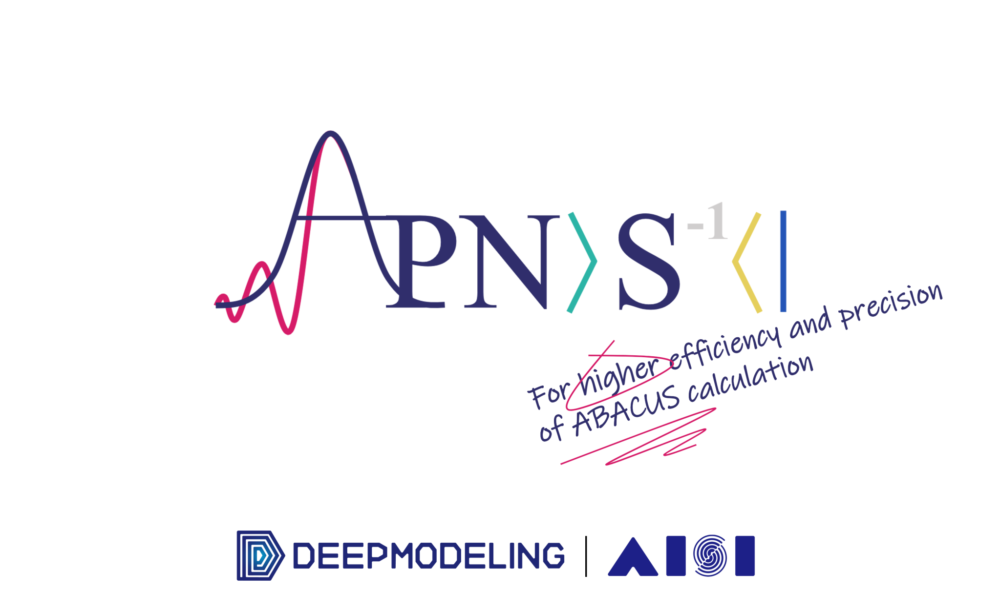

<p align="center">
    
</p>  

# ABACUS Pseudopot-Nao Square  
## In brief  
This folder stores downloaded and generated pseudopotentials.  
## Details
the file `rules.json` stores the rule to add tag to pseudopotential files. If want to use newly added pseudopotential files, please add the corresponding tag to the file, then run code `update_db.py` to refresh the database. The database is `database.json` file, if not exist, will create an empty one.
## Manually search
To benefit from present tag-search based pseudopotential search scheme, one can:
```python
import apns.module_database.search as search

searcher = search.TagSearcher(FDATABASE)
result = searcher(False, False, "Sr", "sr", "DOJO")
print("\n".join(result))

"""
/root/abacus-develop/ABACUS-Pseudopot-Nao-Square/download/pseudopotentials/pbe_s_sr/Sr.upf
/root/abacus-develop/ABACUS-Pseudopot-Nao-Square/download/pseudopotentials/nc-sr-04_pbe_standard_upf/Sr.upf
/root/abacus-develop/ABACUS-Pseudopot-Nao-Square/download/pseudopotentials/nc-sr-05_pbe_standard_upf/Sr.upf
"""
```